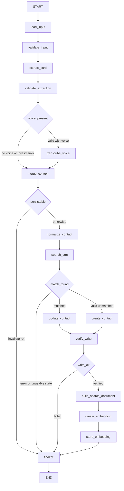

# AI Conference CRM

An end-to-end AI engineering project that turns a business-card image and optional conversation notes into a verified contact record. Vision and speech models interpret inputs; LangGraph orchestrates deterministic validation, matching, SQLite persistence, write verification, and vector indexing.

Reviewed 2026-09-14: capture, typed/voice context, storage, vector retrieval, optional LangSmith instrumentation, and a Discord DM adapter are implemented. Default vectors are **token hashes, not learned semantic embeddings**. The committed evaluation measures fake-provider workflow behavior, not real-model quality.

## Workflow



Invalid input still traverses guarded extraction nodes without calling providers. Embedding failure still traverses `store_embedding`, which skips its write. Querying follows a separate path: `query → embed → nearest vector rows → read contacts → format results`. It neither runs the capture graph nor generates an answer.

## Run locally

Python 3.11+, from the repository root:

```bash
python3 -m venv .venv
source .venv/bin/activate
python -m pip install -e ".[dev]"
python -m pytest -q
```

Set `GROQ_API_KEY` in your environment or local `.env` for capture and the current query entry point. Replace these paths with existing files:

```bash
python -m crm --image /path/to/card.jpg --notes "Met at the conference; discussed warehouse modernization"
python -m crm --image /path/to/card.jpg --voice /path/to/note.ogg
python -m crm query "data warehouse consulting" --limit 5
```

`--name` is optional; the card schema requires a nonblank extracted `full_name`. The database defaults to `data/crm.db`, relative to the working directory. Capture prints selected final-state fields as JSON; exit code is `0` on `complete`, otherwise `1`. See [the run guide](how_to_run.md) for Windows setup, live tests, and Discord details.

## Current implementation

| Component | Implementation | Important limit |
| --- | --- | --- |
| Card extraction | Direct Groq SDK; code default `qwen/qwen3.6-27b`; Pydantic schema | Structure validation does not verify card truth; live model availability was not tested in this review |
| Voice/typed context | Groq `whisper-large-v3`; deterministic concatenation | Notes remain separate from card identity; no reminder extraction |
| Storage | SQLite `ContactStore`; deterministic matching | Nonblank incoming fields overwrite old values; blank fields preserve them; notes append |
| Verification | Re-read and compare intended fields after writes | Verifies persisted extraction output, not extraction accuracy |
| Retrieval | `sqlite-vec` index joined to relational contacts | Default normalized 768-dimensional token hashes; no relevance threshold or measured semantic quality |
| Interfaces | CLI and Discord DMs | Shared personal database, no ownership isolation |
| Observability/evaluation | LangSmith tracing and ten fake-provider scenarios | Instrumentation and regression evidence, not real AI-quality evidence |

Matching uses the strongest available key: email if present, otherwise phone, otherwise name + company. An unmatched email does **not** fall through to phone. Updates do not provide conflict review.

The embedder requires `GROQ_API_KEY` even for its local default. `CRM_EMBED_MODEL` attempts a Groq embeddings call; selected missing-model errors fall back to hashing. This is not a verified supported-model configuration. Index model identity is not stored, and the class advertises 768 dimensions regardless of remote output. Switching models requires a compatibility/rebuild design.

## Verification and observability

On 2026-09-14, `.venv/bin/python -m pytest -q` reported **102 passed, 2 deselected, 142 warnings** in the local Python 3.13 environment. The two live tests were excluded. This establishes offline regression behavior, not live API success or production readiness.

[The committed experiment](eval/latest_experiment.json) gives all ten fake-provider scenarios 1.0. Its `unsupported_field_hallucination` metric is a null-preservation score: higher is better. Read [the architecture/evaluation guide](docs/architecture.md) for precise limits.

`python -m crm.eval` reruns the fake experiment and replaces `eval/latest_experiment.json`. A loaded `LANGSMITH_API_KEY`, including from `.env`, enables result upload; without it, results remain local. CLI tracing is also enabled by this key, under `ai-conference-crm` by default. Traces may include contact data and notes. Discord does not call the CLI tracing initializer; its tracing depends on environment configuration.

For Discord, set `DISCORD_BOT_TOKEN` and `GROQ_API_KEY`, configure the gateway intent described in the run guide, and run `python -m crm.discord_bot`. DM a card, optionally add notes/voice, then type `save`. This shared-data prototype is not a multi-user service.

## Learn and extend

- [Architecture, review assessment, and evaluation definitions](docs/architecture.md)
- [Bite-sized implementation roadmap](docs/learning-roadmap.md): planned tasks with dependencies, acceptance criteria, tests, and learning questions
- [Development harness](AGENTS.md), [progress history](progress_so_far.md), and [lessons learned](understandable_so_far.md)

This is a bounded AI workflow, not an autonomous or multi-agent application. Learned semantic retrieval, real-card evaluation, CI, and privacy/recovery improvements are planned. RAG answer generation, LinkedIn tracking, follow-up drafting, PostgreSQL, and a web UI are not implemented.
